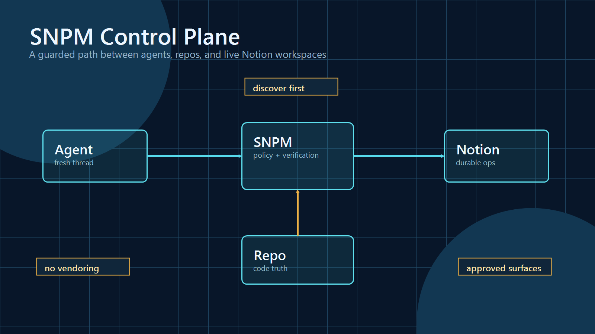
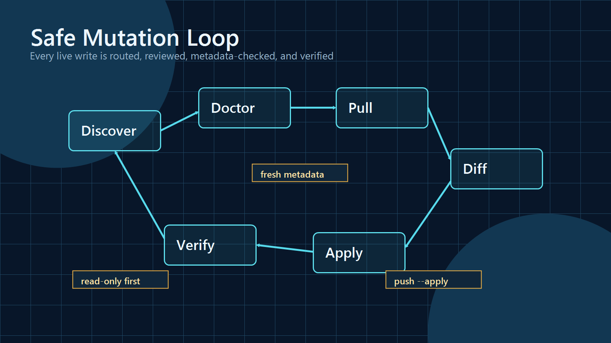
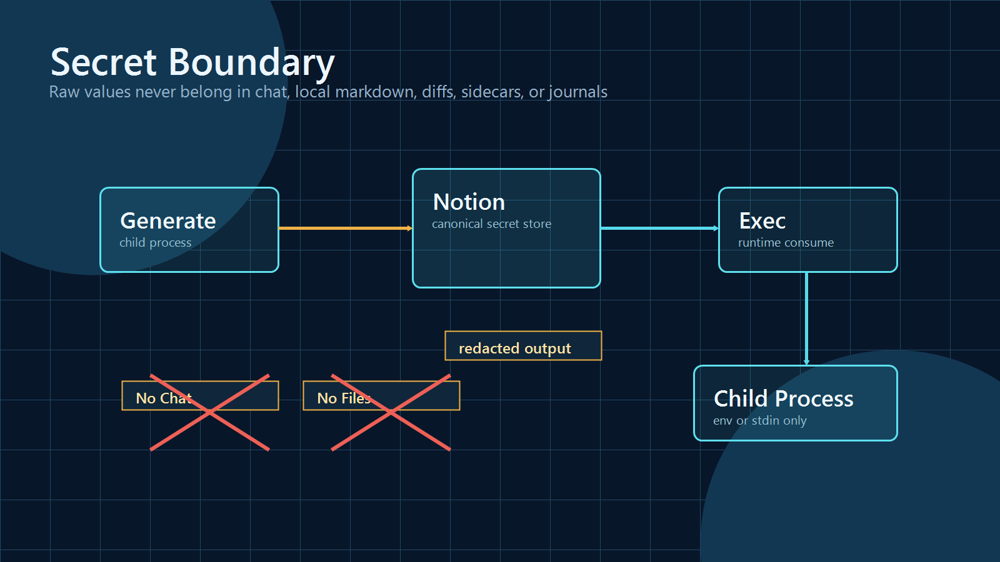

# SNPM

> A guarded Notion control plane for coding agents.

SNPM helps a fresh coding agent find the right Notion surface, make safe project documentation changes, and prove the workspace is still healthy afterward. It is intentionally narrow: approved surfaces only, deterministic routing before mutation, stale-write protection on apply paths, and no raw secret values in chat or local markdown.



## Why It Exists

Coding agents are good at editing files, but live Notion workspaces need stronger guardrails than "just update the page." SNPM gives agents a small command surface for Infrastructure HQ style projects:

- discover how to use SNPM without reading the whole repo
- route work to the repo or Notion before changing anything
- edit only approved Notion surfaces through owning command families
- protect live writes with pull metadata and freshness checks
- keep secrets in Notion while letting child processes consume them safely
- verify project structure, documentation freshness, and explicit consistency markers

SNPM is not a generic Notion CMS. It is a policy layer for project operations.

## Quick Start

Requires Node.js 20+ and a Notion integration token for live workspace commands.

### Source Checkout Mode

```powershell
git clone https://github.com/DrW00kie1/SNPM.git C:\SNPM
Set-Location C:\SNPM
npm install
```

Create local workspace config from the public example:

```powershell
Copy-Item config\workspaces\infrastructure-hq.example.json config\workspaces\infrastructure-hq.json
```

Replace the placeholder page IDs locally. Do not commit the private config. If configs live outside the repo, point SNPM at that directory:

```powershell
$env:SNPM_WORKSPACE_CONFIG_DIR = "C:\path\to\private\workspace-configs"
```

First contact for a fresh agent:

```powershell
npm run discover -- --project "Project Name"
npm run doctor -- --project "Project Name" --project-token-env PROJECT_NAME_NOTION_TOKEN
```

`discover` is the compact starting point. It prints JSON only: what SNPM is, where to run it from, what not to vendor into consumer repos, and which safe command to run next.

### Installed CLI Mode

Installed use is the target cross-repo operator model backed by the package executable metadata. In that mode, run the package executable from any repo instead of switching into a source checkout:

```powershell
snpm discover --project "Project Name"
snpm doctor --project "Project Name" --project-token-env PROJECT_NAME_NOTION_TOKEN
```

Installed mode must not rely on private config inside the package. Keep the real workspace config in an operator-owned directory and point the CLI at it:

```powershell
$env:SNPM_WORKSPACE_CONFIG_DIR = "C:\path\to\private\workspace-configs"
```

For default local operation, source checkout mode remains the safest path. Installed mode is for reviewed tarball or Git installs with private workspace config supplied outside the package.

## The Safe Mutation Loop



SNPM live edits follow a deliberately boring loop:

```powershell
npm run doctor -- --project "Project Name" --project-token-env PROJECT_NAME_NOTION_TOKEN
npm run recommend -- --project "Project Name" --intent planning --page "Roadmap" --project-token-env PROJECT_NAME_NOTION_TOKEN
npm run page-pull -- --project "Project Name" --page "Planning > Roadmap" --output roadmap.md --project-token-env PROJECT_NAME_NOTION_TOKEN
npm run page-diff -- --project "Project Name" --page "Planning > Roadmap" --file roadmap.md --project-token-env PROJECT_NAME_NOTION_TOKEN
npm run page-push -- --project "Project Name" --page "Planning > Roadmap" --file roadmap.md --project-token-env PROJECT_NAME_NOTION_TOKEN --apply
npm run verify-project -- --name "Project Name" --project-token-env PROJECT_NAME_NOTION_TOKEN
```

Pull commands write strict sidecar metadata such as `roadmap.md.snpm-meta.json`. Apply commands refuse to write when that metadata is missing, mismatched, stale, archived, or in trash. Applied mutations append redacted operational entries to the local mutation journal.

## What SNPM Manages

| Surface | Command family | Purpose |
| --- | --- | --- |
| Project bootstrap | `create-project`, `scaffold-docs` | Create a project tree and preview starter docs. |
| Project health | `verify-project`, `doctor` | Verify structure and inspect managed surfaces. |
| Planning pages | `page-*` | Edit approved planning pages only. |
| Curated docs | `doc-*` | Manage approved project, template, and workspace docs. |
| Runbooks | `runbook-*` | Manage project runbooks. |
| Access domains | `access-domain-*` | Manage project Access containers. |
| Secrets and tokens | `secret-record-*`, `access-token-*` | Consume existing raw values safely and ingest generated values write-only. |
| Validation sessions | `validation-session-*`, `validation-sessions-*` | Manage validation reports, validation-session surfaces, and API-visible bundle checks with manual UI follow-up. |
| Manifest sync | `sync check`, `sync pull`, `sync push` | Coordinate approved mixed-surface documentation bundles. |
| Discovery and planning | `discover`, `capabilities`, `recommend`, `plan-change` | Help agents choose the right next command. |

Use `node src/cli.mjs --help` for the top-level surface and `node src/cli.mjs <command> --help` for exact flags.

## Manifest V2 Bundles

Manifest v2 is for coordinated, approved documentation work across multiple surfaces. It supports:

- `sync check` for read-only comparison
- `sync pull` for local markdown and sidecar refresh
- `sync push` for guarded existing-target updates
- entry selectors with `--entry` and `--entries-file`
- preview review artifacts with `--review-output`
- conservative mutation budgets with `--max-mutations`
- opt-in post-push sidecar refresh with `--refresh-sidecars`

Draft a manifest from a plan without writing files:

```powershell
npm run plan-change -- --targets-file plan-targets.json --manifest-draft --project "Project Name" --project-token-env PROJECT_NAME_NOTION_TOKEN
```

Then review, save the manifest yourself, and run the explicit sync command you want.

## Secret Boundary



SNPM is designed so agents do not need users to paste secrets into chat.

Runtime consumption:

```powershell
npm run secret-record-exec -- --project "Project Name" --domain "App" --title "DATABASE_URL" --env-name DATABASE_URL --project-token-env PROJECT_NAME_NOTION_TOKEN -- node script.js
```

Generated secret ingestion:

```powershell
npm run secret-record-generate -- --project "Project Name" --domain "App" --title "DATABASE_URL" --mode create --project-token-env PROJECT_NAME_NOTION_TOKEN --apply -- node generate-dsn.js
```

Rules:

- pulls for secret-bearing records are redacted-only
- raw local export is unsupported
- local secret markdown `edit`, `diff`, and `push` are disabled
- generated values may exist only in memory and in the allowlisted Notion write body
- journal entries, sidecars, review artifacts, stdout, and stderr never store raw secret values

## Safety Model

SNPM keeps the public repo and live workspace separated:

- real Notion page IDs live in ignored local config, not git
- `SNPM_WORKSPACE_CONFIG_DIR` can point at private config outside the checkout
- consumer repos should call into `C:\SNPM`, not vendor SNPM scripts or IDs
- project-token scoped commands prefer project integrations when provided
- Notion mutation is apply-gated and restricted to approved surfaces
- `truth-audit` and `consistency-audit` are advisory read-only checks

Public-readiness expectations:
- the source tree remains safe to publish as MIT-licensed source only when private workspace config and task-local memory stay ignored
- package metadata must keep the installed `snpm` executable, Node runtime expectation, and explicit package allowlist for the CLI/runtime files, docs needed for operation, public examples, and assets
- package publishing must exclude private workspace config, mutation journals, sidecars, review/scaffold/closeout artifacts, task memory, environment files, and local browser/auth state
- installed CLI use must load real workspace config through `SNPM_WORKSPACE_CONFIG_DIR` or another explicit operator-provided path, not bundled private config
- changing GitHub or package visibility is a separate operator action after `npm pack --dry-run` output is reviewed

## Command Discovery

For humans:

```powershell
node src/cli.mjs --help
node src/cli.mjs sync push --help
node src/cli.mjs secret-record exec --help
```

For agents:

```powershell
npm run discover -- --project "Project Name"
npm run capabilities
```

`capabilities` returns the full machine-readable command registry. Use it after `discover`, not as the first-contact path.

## Development

```powershell
npm install
npm test
```

Public packaging smoke:

```powershell
npm pack --dry-run
```

Before public packaging, verify that the packed file list is allowlisted and does not include private workspace config, `.snpm*` artifacts, generated review/scaffold/closeout output, task-memory files, or environment files.

Live verification, when private config and tokens are present:

```powershell
npm run verify-project -- --name "Project Name" --project-token-env PROJECT_NAME_NOTION_TOKEN
npm run doctor -- --project "Project Name" --project-token-env PROJECT_NAME_NOTION_TOKEN
npm run validation-sessions-verify -- --project "Project Name" --project-token-env PROJECT_NAME_NOTION_TOKEN --bundle
npm run truth-audit -- --project "Project Name" --project-token-env PROJECT_NAME_NOTION_TOKEN
npm run consistency-audit -- --project "Project Name" --project-token-env PROJECT_NAME_NOTION_TOKEN
npm run verify-workspace-docs
```

## Deeper Docs

- [Agent quickstart](docs/agent-quickstart.md)
- [Fresh project usage](docs/fresh-project-usage.md)
- [New thread handoff](docs/new-thread-handoff.md)
- [Workspace config](docs/workspace-config.md)
- [Project bootstrap](docs/project-bootstrap.md)
- [Project Access and secrets](docs/project-access.md)
- [Validation sessions](docs/validation-sessions.md)
- [Validation-session manual UI bundle](docs/validation-session-ui-bundle.md)
- [Manifest and validation-session sync](docs/validation-session-sync.md)
- [Operator roadmap](docs/operator-roadmap.md)
- [Development plan](docs/development-plan.md)
- [Live Notion docs registry](docs/live-notion-docs.md)

## License

MIT. See [LICENSE](LICENSE).
